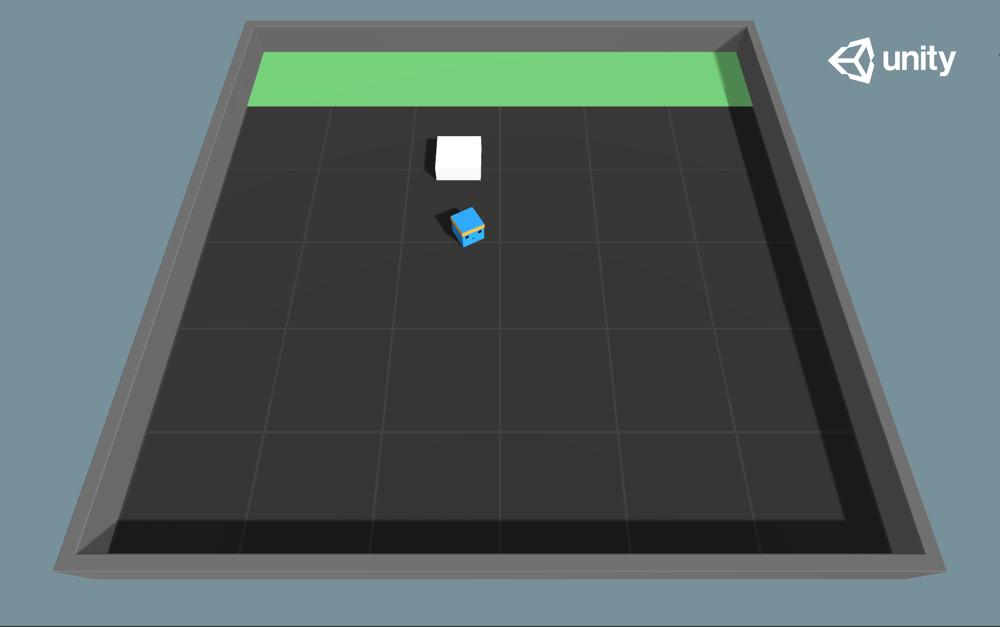

# PushBlock

- Set-up: A platforming environment where the agent can push a block around.
- Goal: The agent must push the block to the goal.
- Agents: The environment contains one agent.
- Agent Reward Function:
  - -0.0025 for every step.
  - +1.0 if the block touches the goal.
- Behavior Parameters:
  - Vector Observation space: (Continuous) 70 variables corresponding to 14
    ray-casts each detecting one of three possible objects (wall, goal, or
    block).
  - Actions: 1 discrete action branch with 7 actions, corresponding to turn clockwise
    and counterclockwise, move along four different face directions, or do nothing.
- Float Properties: Four
  - block_scale: Scale of the block along the x and z dimensions
    - Default: 2
    - Recommended Minimum: 0.5
    - Recommended Maximum: 4
  - dynamic_friction: Coefficient of friction for the ground material acting on
    moving objects
    - Default: 0
    - Recommended Minimum: 0
    - Recommended Maximum: 1
  - static_friction: Coefficient of friction for the ground material acting on
    stationary objects
    - Default: 0
    - Recommended Minimum: 0
    - Recommended Maximum: 1
  - block_drag: Effect of air resistance on block
    - Default: 0.5
    - Recommended Minimum: 0
    - Recommended Maximum: 2000
- Benchmark Mean Reward: 4.5
